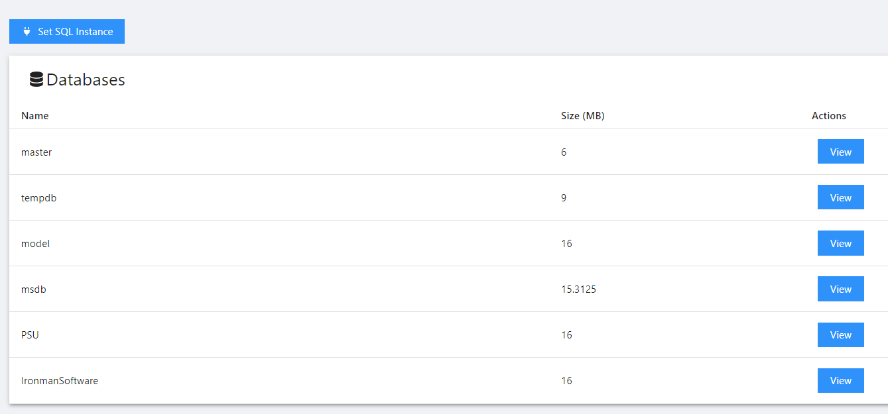
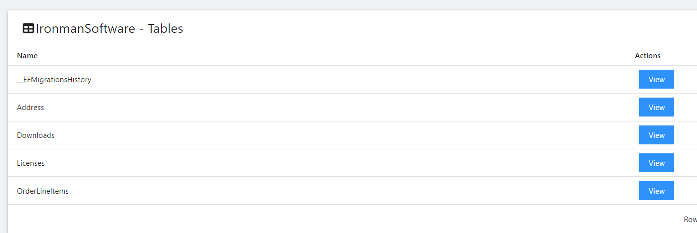
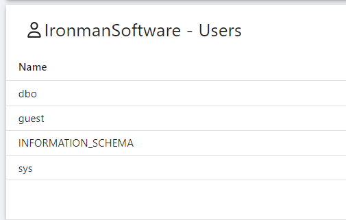
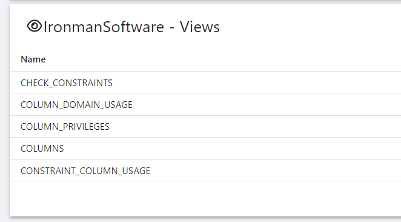
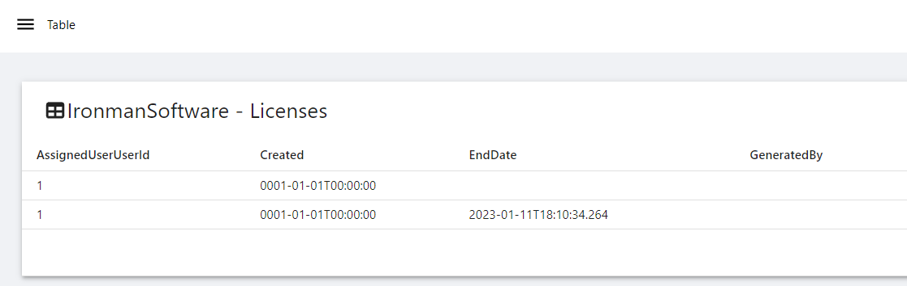

# PowerShell Universal Dashboard Explorer

View databases, tables, users and data in your MS SQL server.

# Requirements

This template requires the `dbatools` module.

```powershell
Install-Module dbatools
```

# Usage

By default, this dashboard connects to `(localdb)\MSSQLLocalDB`. You can connect another MS SQL Server instance by using the Set SQL Instance key. 

# Screenshots









